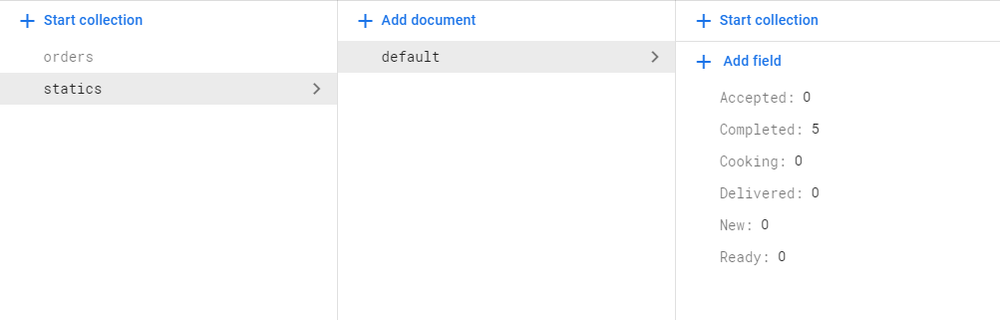
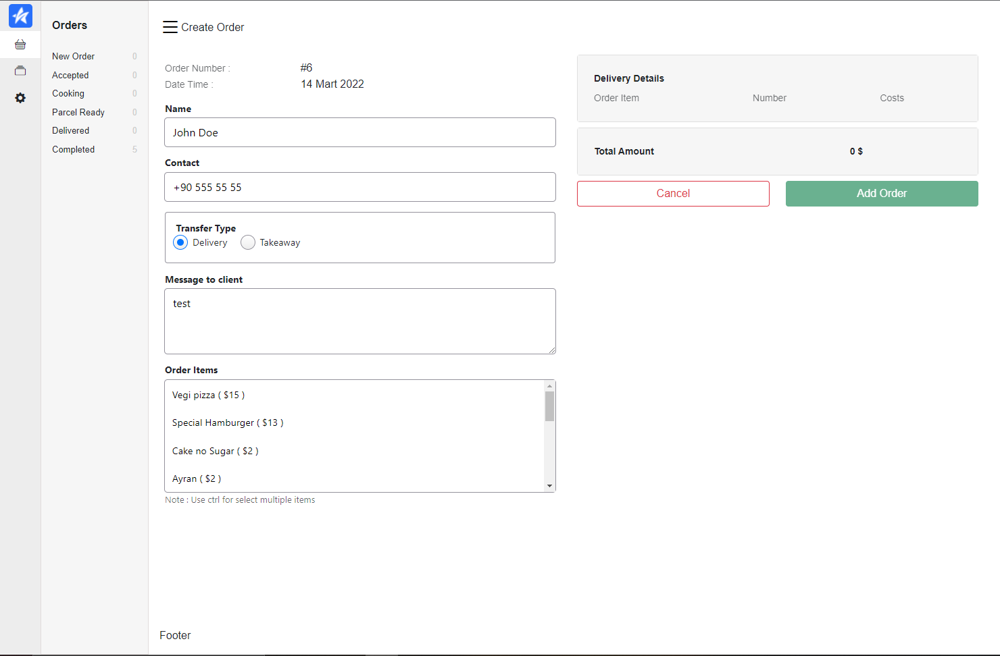
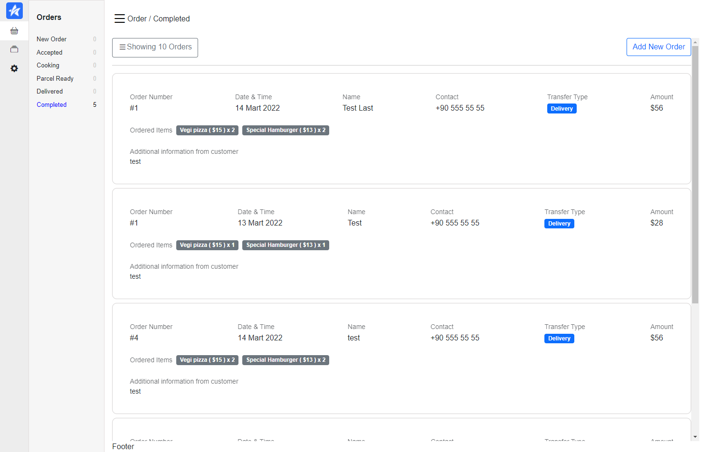
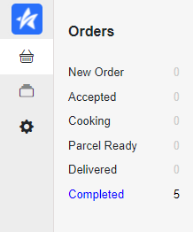

# firebase setup

```
change firebase.js file

const db = firebase.initializeApp({
  your Options
}).firestore()

Please setup your static document in your firestore like below picture

statics => default => { 
  "New":0,
  "Accepted":0,
  "Cooking":0,
  "Ready":0,
  "Delivered":0,
  "Completed":0
}
```

<h3>Add New Order</h3>

<h3>Order List</h3>

<h3>Filter Bar</h3>


## Project setup
```
npm install
```

### Compiles and hot-reloads for development
```
npm run serve
```

### Compiles and minifies for production
```
npm run build
```


### Lints and fixes files
```
npm run fix
```

